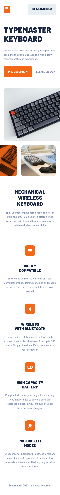
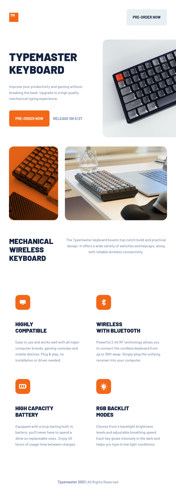
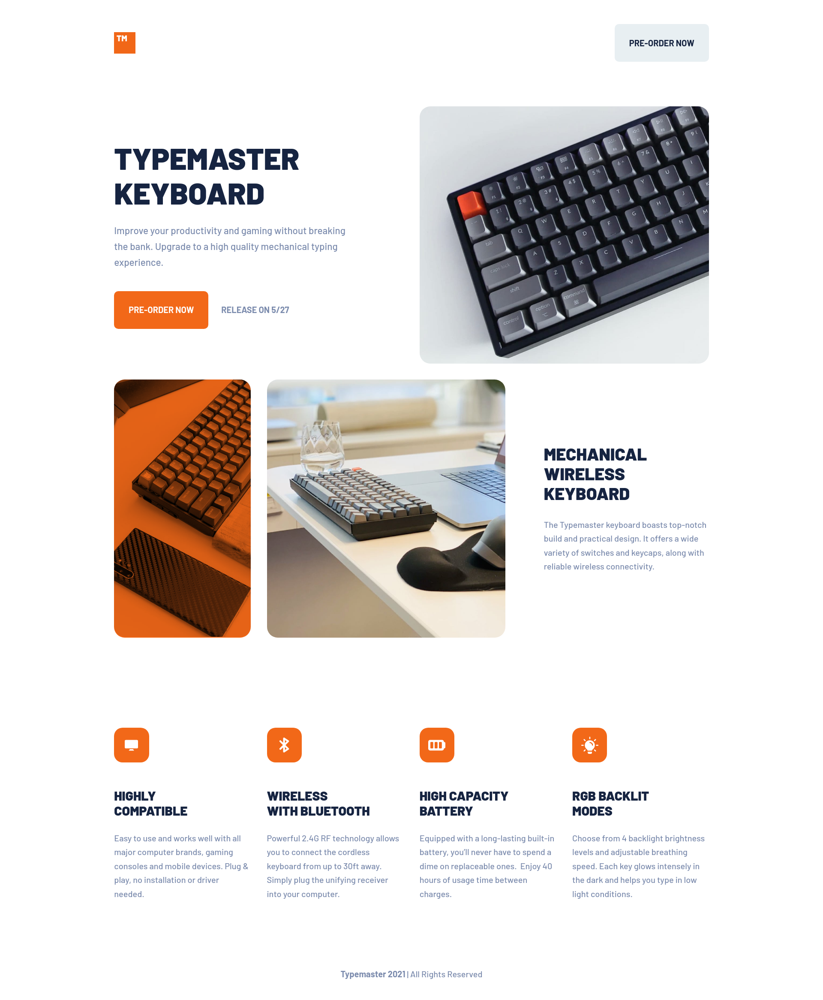

# Frontend Mentor - Typemaster pre-launch landing page solution

Hi, this is my solution to the [Typemaster pre-launch landing page challenge on Frontend Mentor]("").

## Table of contents

- [Frontend Mentor - Typemaster pre-launch landing page solution](#frontend-mentor---typemaster-pre-launch-landing-page-solution)
  - [Table of contents](#table-of-contents)
  - [Overview](#overview)
    - [Screenshot](#screenshot)
    - [Links](#links)
  - [My process](#my-process)
    - [Built with](#built-with)
    - [What I learned](#what-i-learned)
  - [Author](#author)

## Overview

### Screenshot






### Links

- Solution URL: [Link to my repository on GitHub](https://github.com/LitJowel/typemaster-landing-page)
- Live Site URL: [Link to my project deployment on Github Pages](https://your-live-site-url.com)

## My process

### Built with

- Semantic HTML5 markup
- CSS custom properties
- Flexbox
- CSS Grid
- Mobile-first workflow

### What I learned

Well, I learned a little trick for the pictures. This propery helps to remove the imaginary margin that is created in the section below the images.

```css
img {
	vertical-align: text-top;
}
```

I had another problem with the media queries, I had use standard breakpoints, but at certain sizes the content didn't look right so I had to set fixed widths and center it horizontally to make it look right until the next breakpoint.

## Author

You can follow me on any of these social networks.

- Frontend Mentor - [@LitJowel](https://www.frontendmentor.io/profile/LitJowel)
- Twitter - [@LitJowel](https://twitter.com/LitJowel)
